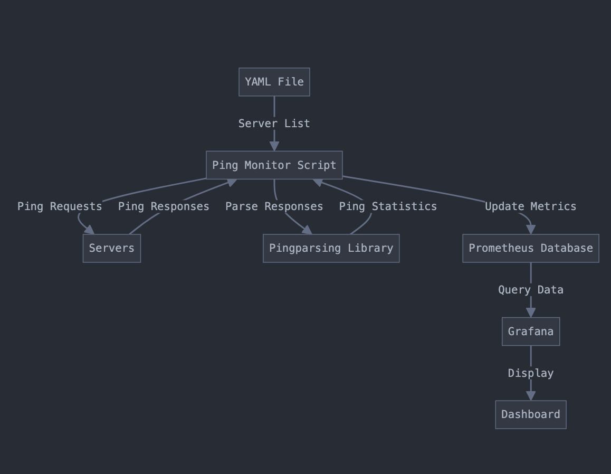

# Synthetic Monitoring

This project is designed to monitor network latency and availability by parsing ping results and configuration files. The system allows for customizable monitoring of multiple servers with specific intervals and probe counts defined for each.

## System Architecture



## Project Structure

- **config.yaml**: The main configuration file where servers, intervals, and probe counts are defined.
- **parsePing.py**: Script for parsing the results of ping commands to extract relevant metrics.
- **parseYaml.py**: Script to parse the `config.yaml` file, extracting the configuration settings for each server.
- **pingMonitor.py**: The main monitoring script that coordinates the pinging of servers, uses `parseYaml.py` to load configurations, and invokes `parsePing.py` to handle the results. The script also transports the metrics to Prometheus, which then forwards them to Grafana for visualization in a dashboard.

## Configuration

The `config.yaml` file defines the servers to monitor and the intervals at which they should be probed. Below is an example configuration:

```yaml
servers:
  - address: "chatgpt.com"
    probes: 8     # Number of ping probes
  - address: "linkedin.com"
    probes: 6
  - address: "maps.ucsd.edu"
    probes: 10
interval: 1  # Global interval for all servers in seconds
```
## Usage

### Setup Configuration:

- Edit the `config.yaml` file to define the servers you want to monitor, the number of probes for each server, and the interval at which the pings should be sent.

### Run the Monitoring Script:

- Execute `pingMonitor.py` to start monitoring the servers defined in `config.yaml`.

    ```bash
    python pingMonitor.py
    ```

### Metrics Collection and Visualization:

- The `pingMonitor.py` script will send the collected metrics to Prometheus.
- Prometheus will then be responsible for gathering these metrics, which can be visualized in Grafana.
- You can create a dashboard in Grafana to visualize the ping results and track the performance of the monitored servers in real-time.

## Requirements

- Python 3.x
- Prometheus (for metrics storage)
- Grafana (for dashboard visualization)
- Install the dependencies from ```requirements.txt```


